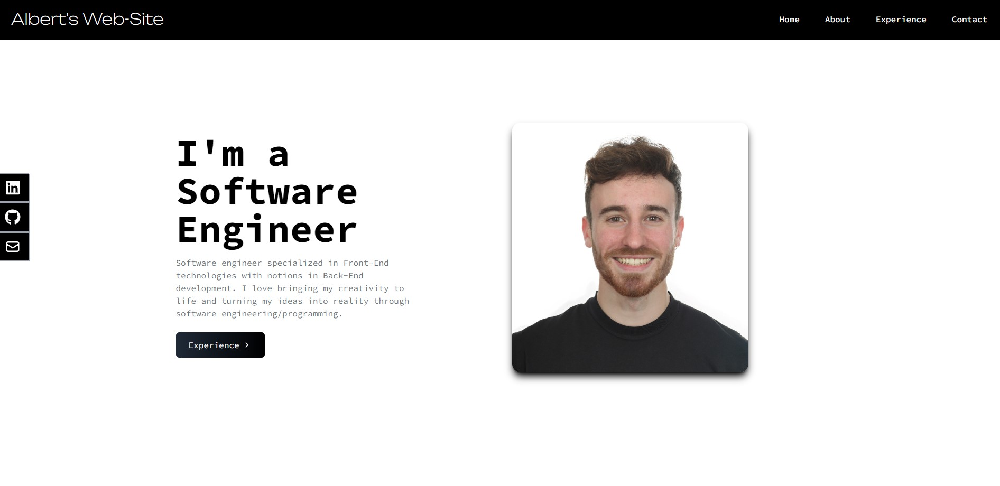
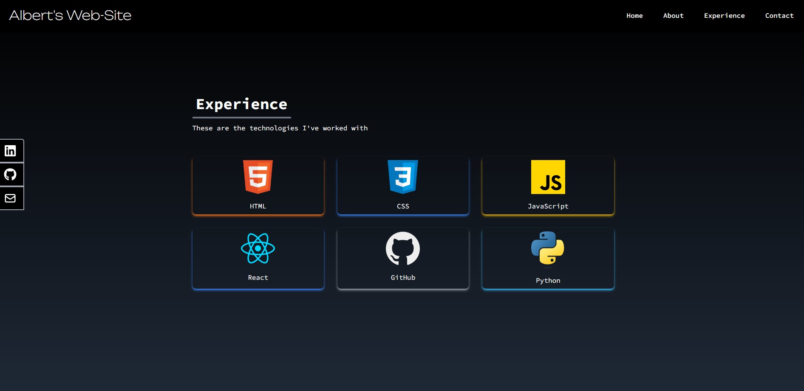
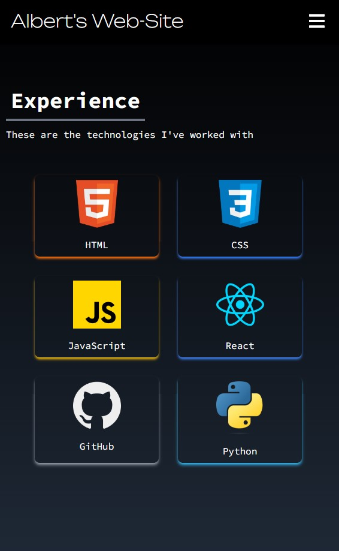

## React Portfolio with Tailwind CSS

Welcome to my personal portfolio website! This project showcases my skills and projects as a web developer, built using React and Tailwind CSS. Below you'll find details on how the project is structured!

## Overview

This portfolio website serves as a platform to display my recent projects, technical skills, and professional background. It includes sections like:

- About Me
- Skills/Experience
- Contact Information

## Screenshots

## Features

- Responsive Design: Adapts to different screen sizes.

- Social Media Links: Responsive and animated social media links in the middle left part of the screen.

- Smooth Animations: Minimal yet elegant animations for a better user experience.

- Contact Form: Integrated contact form to send messages directly.
